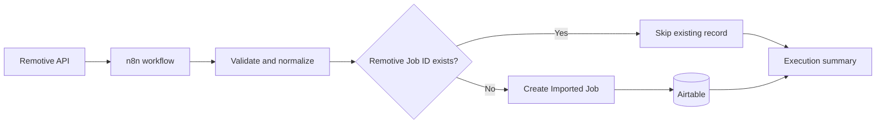
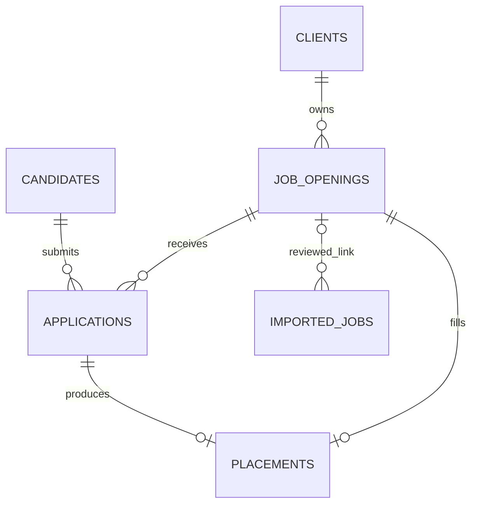
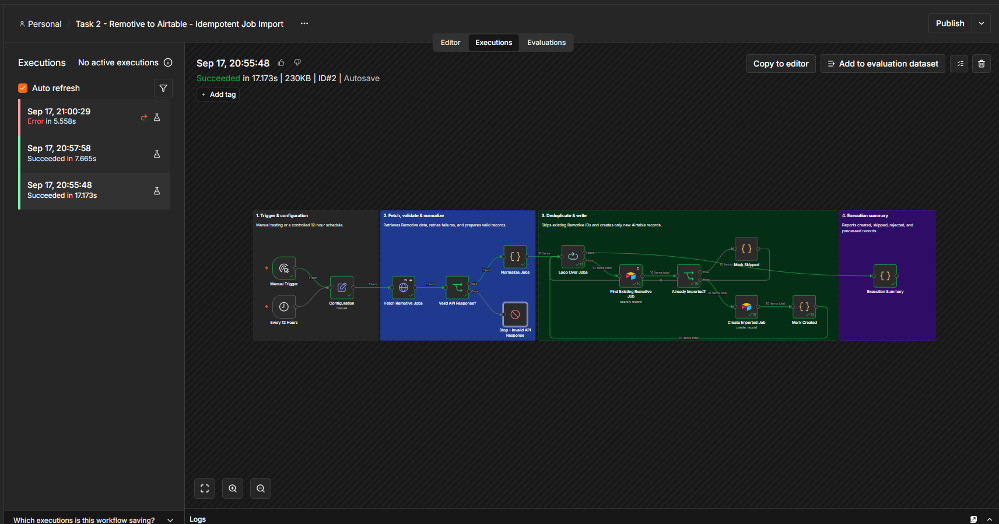
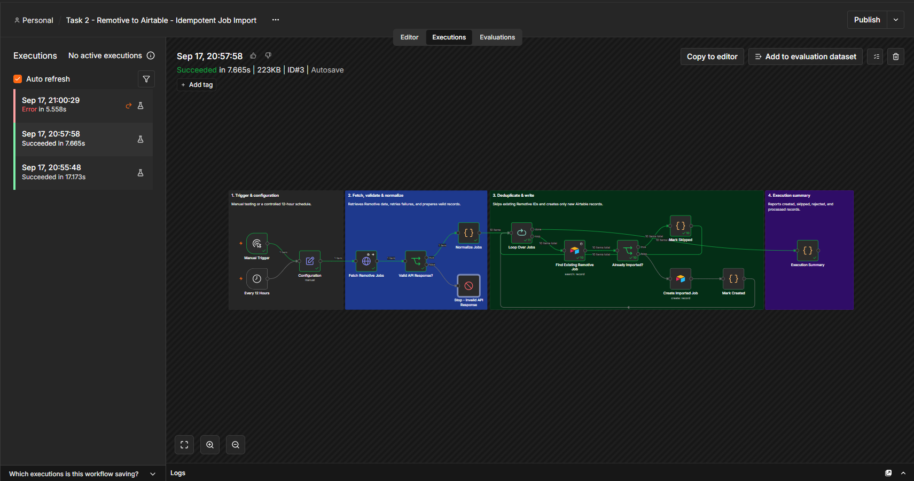
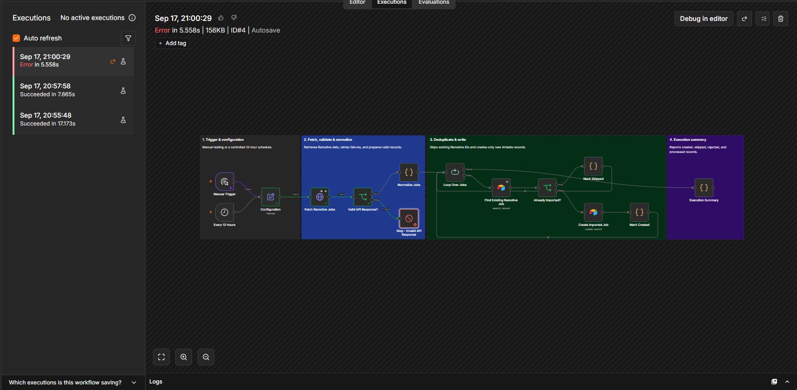

# Airtable + n8n Recruitment Automation

A portfolio project that models a staffing agency's recruitment pipeline in Airtable and automates external job ingestion with n8n and the Remotive API.

The solution combines a relational-style Airtable design, idempotent API imports, input validation, retry handling, controlled failure paths, and maintainer-focused documentation.

[View the read-only Airtable base](https://airtable.com/appjWilmBmSIATTmC/shrYU01l9fDnAm1Ft)

## What this project demonstrates

- Relational data modeling with linked Airtable records.
- Many-to-many modeling through an Applications junction table.
- Business-useful lookups, rollups, formulas, and validation indicators.
- Public API integration and field normalization in n8n.
- Idempotent imports using a stable external identifier.
- Retry behavior, response validation, and controlled failure handling.
- Credential-safe workflow export and practical production trade-offs.

## Solution architecture



The Airtable base separates approved agency vacancies from public market listings. Imported jobs remain in a staging table until a recruiter reviews and optionally links them to an approved opening.



## Automation flow

1. Start manually or on a controlled 12-hour schedule.
2. Fetch a bounded set of jobs from the public Remotive API.
3. Validate the response structure and required job fields.
4. Normalize URLs, timestamps, descriptions, and source metadata.
5. Process each job and search Airtable by `Remotive Job ID`.
6. Skip existing records or create a correctly mapped Imported Jobs record.
7. Report created, skipped, rejected, and processed totals.

## Reliability evidence

The workflow was exercised across three repeatable scenarios:

The screenshots were captured during implementation validation before the workflow was renamed for portfolio publication.

| Scenario | Result |
| --- | --- |
| Initial import | 10 Remotive jobs were validated and created in Airtable |
| Repeated execution | All 10 existing IDs were skipped and no duplicates were created |
| Deliberate API failure | Validation stopped the run before any Airtable write occurred |

### Initial import



### Duplicate-safe repeat run



### Controlled failure



## Repository structure

```text
airtable-n8n-recruitment-automation/
|-- README.md
|-- airtable/
|   |-- README.md
|   `-- FIELD_DICTIONARY.md
|-- n8n/
|   |-- README.md
|   `-- remotive-airtable-import.json
`-- docs/
    |-- ARCHITECTURE.md
    |-- TESTING.md
    |-- ROADMAP.md
    |-- DEMO_GUIDE.md
    `-- images/
```

## Quick start

### 1. Recreate the Airtable schema

Use [`airtable/FIELD_DICTIONARY.md`](airtable/FIELD_DICTIONARY.md) to create the six tables, linked-record fields, formulas, lookups, and rollups. Use fictional data when evaluating the project.

### 2. Import the n8n workflow

Import [`n8n/remotive-airtable-import.json`](n8n/remotive-airtable-import.json) into n8n.

### 3. Configure Airtable access

Create an Airtable Personal Access Token with access only to your own base and the minimum required scopes:

- Record read
- Record write
- Base schema read

Assign the credential to both Airtable nodes, then select your base and Imported Jobs table. The exported workflow intentionally contains no credential object or token.

### 4. Validate before activation

Run the workflow manually three times:

1. Confirm new records are created.
2. Run it again and confirm the same IDs are skipped.
3. Enable the controlled failure setting, confirm the workflow stops safely, and restore the setting to `false`.

Activate the schedule only after all three checks pass.

## Key design decisions

### Applications as a junction table

Candidates and job openings have a many-to-many relationship. Applications resolves that relationship and stores the stage, date, recruiter, rating, and notes for each candidate-opening combination.

### Imported Jobs as a staging table

A public listing does not prove that the agency has an approved recruiting mandate. External listings therefore remain separate from Job Openings until reviewed.

### Skip rather than overwrite

Known Remotive IDs are skipped so an automated import cannot overwrite recruiter-managed fields such as review status or a link to an approved opening.

## Current limitations

- Airtable formulas can flag duplicate applications or multiple placements but cannot enforce relational uniqueness.
- Search-then-create is not atomic, so concurrent runs could theoretically race.
- Existing Remotive jobs are skipped rather than synchronized when the source changes.
- Failures are visible in n8n execution history but do not yet send external alerts.

See [`docs/ROADMAP.md`](docs/ROADMAP.md) for the production-hardening plan.

## Security

- No Airtable token or n8n credential is stored in this repository.
- The workflow export is inactive by default.
- All recruitment sample data is fictional.
- The public Airtable link is read-only.
- Credentials should be scoped to a single base and rotated if exposed.

## Documentation

- [Airtable implementation](airtable/README.md)
- [Complete field dictionary](airtable/FIELD_DICTIONARY.md)
- [n8n setup and operation](n8n/README.md)
- [Architecture and SQL comparison](docs/ARCHITECTURE.md)
- [Test scenarios and results](docs/TESTING.md)
- [Demonstration guide](docs/DEMO_GUIDE.md)

## Author

Built by **gaboscini** as a practical automation portfolio project.

## License

This project is available under the [MIT License](LICENSE).
