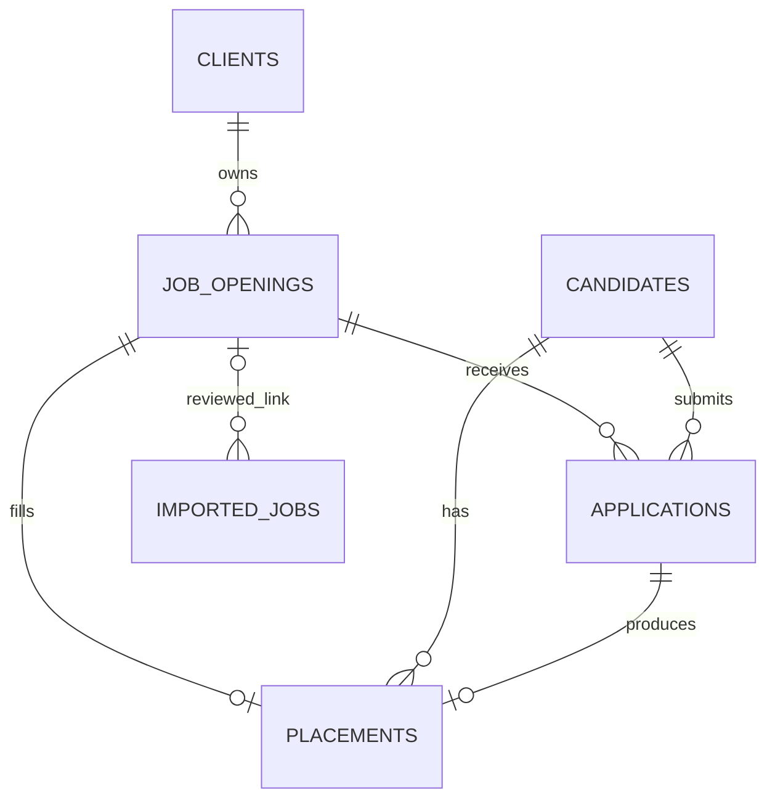
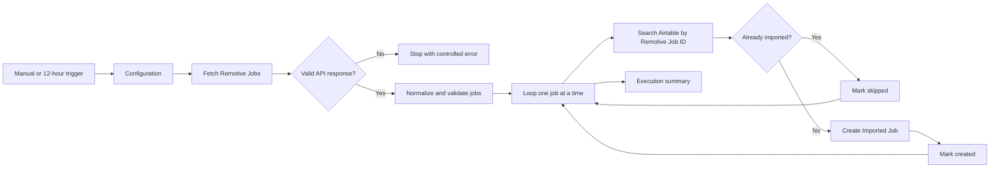

# Architecture and Design Decisions

## 1. Purpose and scope

This solution supports a staffing agency's core recruitment pipeline. It records client organizations, their approved job openings, reusable candidate profiles, applications to specific openings, and successful placements. It also provides a controlled staging area for public job listings imported from the Remotive API.

The Airtable base is designed as a maintainable operational system rather than a flat spreadsheet. Relationships are modeled explicitly, structured field types are used wherever practical, and calculated fields expose important controls such as active-opening counts, duplicate candidate-opening combinations, invalid salary ranges, and multiple placements against one opening.

All demonstration organizations, contacts, candidates, and recruitment records are fictional. The Imported Jobs table contains real public listings retrieved from Remotive by the n8n import workflow.

## 2. Airtable schema and design reasoning

### Why the base is structured this way

The base separates each business concept into its own table so that information is entered once and reused consistently:

- **Clients** stores customer organizations and their primary commercial contacts.
- **Job Openings** stores agency-approved vacancies. Each opening belongs to one client.
- **Candidates** stores reusable candidate profiles independently from any particular vacancy.
- **Applications** connects candidates to openings and stores the status of that specific recruitment process.
- **Placements** stores successful hires and their start date, fee, guarantee period, and placement status.
- **Imported Jobs** stages public Remotive listings until they are reviewed and, if relevant, linked to an agency-managed opening.

This avoids repeating client details on every vacancy or candidate details on every application. It also prevents an external public listing from being treated automatically as an approved client requirement.

### Relationships

| Relationship | Cardinality | Airtable implementation | Reason |
| --- | --- | --- | --- |
| Client to Job Openings | One-to-many | `Job Openings.Client` is a single linked record; `Clients.Job Openings` is reciprocal and multiple | One client can own many approved openings, but each opening has one client |
| Candidate to Applications | One-to-many | `Applications.Candidate` is single; `Candidates.Applications` is multiple | A candidate can apply to multiple openings over time |
| Job Opening to Applications | One-to-many | `Applications.Job Opening` is single; `Job Openings.Applications` is multiple | An opening can receive multiple applications |
| Candidate to Job Opening | Many-to-many | Resolved through Applications | Application-specific stage, date, rating, owner, and notes belong on the junction record |
| Application to Placement | Zero-to-one | `Placements.Application` is single | A placement must originate from one successful application |
| Job Opening to Placement | Zero-to-one | `Placements.Job Opening` is single; placement count and control fields expose violations | Each opening can produce at most one placement |
| Candidate to Placement | One-to-many | `Placements.Candidate` is single | Direct link supports simple Airtable reporting and must match the selected application |
| Job Opening to Imported Jobs | Zero-to-many | `Imported Jobs.Linked Job Opening` is single and optional | An imported listing remains staged unless it is reviewed and linked |



### Why Applications is a junction table

Candidates and openings have a many-to-many relationship: one candidate can apply to several openings, and one opening can receive applications from several candidates. A direct link between Candidates and Job Openings would not provide a clean place to store application-specific information. The Applications table resolves this relationship and holds the application date, pipeline stage, recruiter owner, candidate rating, resume reference, and application notes.

`Application Key` combines the candidate and opening identifiers. It makes accidental duplicate candidate-opening combinations visible in Airtable. It is a detection control rather than a hard uniqueness constraint.

### Why Placements is separate

A placement is a commercial outcome, not merely another application stage. It has its own start date, placement fee, guarantee period, operational status, and notes. Keeping Placements separate avoids adding placement-only fields to every unsuccessful application.

The Airtable implementation links a placement directly to its application, candidate, and opening to simplify reporting. `Placement Count` and `Placement Control` make violations of the one-placement-per-opening rule visible. Airtable cannot enforce this rule as strongly as a relational unique constraint, so the final safeguard would remain procedural unless an automation is added.

### Why Imported Jobs is separate

Remotive contains public market listings, whereas Job Openings represents approved vacancies handled by the staffing agency. Automatically mixing the two would imply a client relationship or recruiting mandate that may not exist. Imported Jobs therefore acts as a staging table with its own review status, source metadata, publication details, and stable deduplication key. A reviewer can link a relevant imported record to an approved opening later.

### Useful lookups, rollups, and controls

- `Clients.Total Openings` counts every linked opening.
- `Clients.Active Openings` sums the `Open Flag` values of linked openings.
- `Job Openings.Client Industry` looks up the linked client's industry.
- `Job Openings.Application Count` counts linked applications.
- `Job Openings.Placement Count` counts linked placements.
- `Applications.Candidate Email` and `Applications.Opening Title` expose operational context without duplicating source data.
- `Placements.Candidate Name` and `Placements.Opening Title` improve readability while preserving linked sources.
- `Job Openings.Placement Control` flags more than one linked placement.
- `Job Openings.Salary Validation` flags a salary minimum greater than the maximum.
- `Imported Jobs.Deduplication Key` produces `remotive:<job-id>` for integration matching.

## 3. Relational SQL/Postgres design

### What would change

The same business entities would remain separate in Postgres, but the implementation would use database-enforced primary keys, foreign keys, unique constraints, check constraints, transactions, and indexes. Airtable reciprocal links, lookups, and rollups would generally become joins, views, or aggregate queries rather than stored fields.

Postgres would also reduce deliberate Airtable denormalization. For example, a placement's candidate can be derived through its application, so `candidate_id` would not need to be stored on Placements. If `opening_id` is stored on Placements to enforce one placement per opening efficiently, a composite foreign key would ensure that it agrees with the selected application.

### Proposed tables and keys

#### `clients`

- `id uuid primary key default gen_random_uuid()`
- `client_code text not null unique`
- `name text not null`
- `industry text not null`
- `status client_status not null`
- Contact and billing fields
- `created_at timestamptz not null default now()`
- `updated_at timestamptz not null default now()`

#### `job_openings`

- `id uuid primary key default gen_random_uuid()`
- `opening_code text not null unique`
- `client_id uuid not null references clients(id) on delete restrict`
- Title, department, employment type, work arrangement, location, and hiring-manager fields
- `status opening_status not null`
- `salary_min numeric(12,2)`
- `salary_max numeric(12,2)`
- `salary_currency char(3)`
- Open and target-start dates
- `check (salary_min is null or salary_max is null or salary_min <= salary_max)`
- `check (salary_currency is null or salary_currency ~ '^[A-Z]{3}$')`
- Created and updated timestamps

#### `candidates`

- `id uuid primary key default gen_random_uuid()`
- `candidate_code text not null unique`
- Name, email, phone, location, current title, experience, source, availability, and salary fields
- `status candidate_status not null`
- Created and updated timestamps

Candidate email should be indexed case-insensitively for search and duplicate review. It should be made unique only if the agency confirms that one email can never represent more than one valid candidate profile.

#### `applications`

- `id uuid primary key default gen_random_uuid()`
- `application_code text not null unique`
- `candidate_id uuid not null references candidates(id) on delete restrict`
- `opening_id uuid not null references job_openings(id) on delete restrict`
- Application date, stage, recruiter owner, stage-change date, rating, resume reference, and notes
- `unique (candidate_id, opening_id)` to prevent duplicate applications for the same candidate and opening
- `unique (id, opening_id)` to support a placement consistency foreign key
- `check (candidate_rating between 1 and 5)` when a rating is present
- Created and updated timestamps

#### `placements`

- `id uuid primary key default gen_random_uuid()`
- `placement_code text not null unique`
- `application_id uuid not null unique`
- `opening_id uuid not null unique`
- `foreign key (application_id, opening_id) references applications(id, opening_id) on delete restrict`
- Start date, placement status, fee, guarantee-end date, and notes
- `check (placement_fee >= 0)` when a fee is present
- Created and updated timestamps

`unique (opening_id)` is the database-level enforcement for the requirement that one opening can have no more than one placement. The composite foreign key ensures that the placement's opening is the same opening referenced by the successful application. Candidate information is derived through `applications.candidate_id`, avoiding redundant storage.

#### `imported_jobs`

- `id uuid primary key default gen_random_uuid()`
- `source text not null`
- `external_job_id text not null`
- External title, company, location, job type, publication timestamp, URL, category, salary text, and description
- `import_status imported_job_status not null default 'new'`
- `linked_opening_id uuid references job_openings(id) on delete set null`
- `imported_at timestamptz not null default now()`
- `source_updated_at timestamptz`
- `unique (source, external_job_id)` for idempotent imports

### Status controls

Stable lifecycle values can use Postgres enums, such as `opening_status`, `application_stage`, `placement_status`, and `imported_job_status`. If business users need to add statuses without a schema migration, reference tables with foreign keys would be preferable to enums.

### Recommended indexes

In addition to indexes created for primary and unique keys:

- `job_openings (client_id, status)`
- `job_openings (open_date)`
- `applications (opening_id, stage)`
- `applications (candidate_id, application_date desc)`
- `placements (start_date, status)`
- `imported_jobs (import_status, publication_date desc)`
- `lower(candidates.email)` for case-insensitive search and duplicate review

Indexes should be confirmed against real query patterns rather than added indiscriminately.

### Delete behavior and auditability

- Clients, openings, candidates, applications, and placements should normally use soft deletion or status changes for operational history.
- Foreign keys use `on delete restrict` where deleting a parent would orphan recruitment or commercial records.
- `imported_jobs.linked_opening_id` uses `on delete set null` because the external source record can remain valid independently.
- `created_at`, `updated_at`, and optional `created_by`/`updated_by` fields should support auditability.
- In Supabase, Row Level Security policies should restrict access by role or business ownership before production use.

### Transactional behavior

Creating a placement should occur in a transaction that:

1. Confirms the application belongs to the selected opening.
2. Confirms the application is eligible for placement.
3. Inserts the placement.
4. Updates the application to `Hired`.
5. Updates the opening to `Filled`.

The unique constraints protect against duplicate outcomes even if two users attempt the action concurrently.

## 4. n8n workflow

The sanitized workflow export, [`../n8n/remotive-airtable-import.json`](../n8n/remotive-airtable-import.json), imports public Remotive listings into Imported Jobs while preserving the boundary between market data and approved client vacancies.

### Trigger and configuration

The workflow supports two entry points:

- **Manual Trigger** for controlled testing and demonstrations.
- **Every 12 Hours** for scheduled operation after the workflow is activated.

Both triggers pass through a Configuration node. The default settings are:

| Setting | Default value | Purpose |
| --- | --- | --- |
| API URL | `https://remotive.com/api/remote-jobs` | Public, no-authentication Remotive endpoint |
| Search term | `developer` | Searches Remotive titles and descriptions |
| Maximum jobs | `10` | Bounds each demonstration batch |
| Simulate failure | `false` | Normal operating state; `true` is used only for the deliberate failure test |

The scheduled trigger makes two requests per day. The workflow must be activated in n8n before scheduled executions will run.

### Main processing steps



The HTTP Request node supplies the configured `search` and `limit` query parameters and is configured for three attempts with a two-second wait between attempts. The workflow also applies its own maximum-record limit because upstream behavior should not be trusted as the only batch-size control.

### Transformation and field mapping

Normalize Jobs performs these controls before any Airtable lookup or write:

- Requires a non-empty `jobs` array.
- Requires a Remotive ID, title, company, valid HTTP/HTTPS URL, and parseable publication date.
- Removes duplicate Remotive IDs within the same response.
- Strips HTML, scripts, and styles from descriptions.
- Collapses whitespace and limits text lengths.
- Converts publication and import timestamps to ISO date-time values.

| Remotive value | Airtable field | Airtable type |
| --- | --- | --- |
| `id` | Remotive Job ID | Single-line text |
| `title` | Job Title | Single-line text |
| `company_name` | Company | Single-line text |
| `candidate_required_location` | Location | Single-line text |
| `job_type` | Job Type | Single-line text |
| `publication_date` | Publication Date | Date and time |
| `url` | Job URL | URL |
| `category` | Category | Single-line text |
| `salary` | Salary Text | Single-line text |
| Constant `Remotive` | Source | Single select |
| Workflow timestamp | Imported At | Date and time |
| Constant `New` | Import Status | Single select |
| Sanitized `description` | Description | Long text |

### Deduplication

Each normalized item is processed separately. Find Existing Remotive Job searches Airtable with an exact formula match on `Remotive Job ID`:

```text
{Remotive Job ID}='<current Remotive ID>'
```

If a match exists, the record is skipped. If no match exists, Create Imported Job inserts the mapped fields. Skipping existing records, rather than overwriting them, preserves a recruiter's Import Status and any link to an approved Job Opening.

### Error handling

The implementation has three deliberate error controls:

1. The HTTP Request node retries transient request failures.
2. Valid API Response prevents malformed or empty responses from reaching transformation or Airtable.
3. Stop - Invalid API Response ends the run with a clear failed execution.

For the controlled failure test, `simulateFailure` changes the URL to a nonexistent endpoint. After the test, it must be restored to `false`.

### Execution summary

After the loop completes, Execution Summary reports the search term, API jobs received, jobs selected, valid and rejected records, created records, skipped duplicates, processed records, deduplication rule, and completion time.

## 5. Setup and operation

### Prerequisites

- Access to the Airtable base `Staffing Agency Recruitment Pipeline`.
- An n8n Cloud or self-hosted instance with the standard HTTP Request, Code, IF, Loop Over Items, Stop and Error, Schedule Trigger, and Airtable nodes.
- A new Airtable Personal Access Token restricted to this base with record-read, record-write, and base-schema-read permissions.

Never use a token that has appeared in chat, screenshots, recordings, or source control.

### Import and configure the workflow

1. In n8n, select **Import from File**.
2. Import [`../n8n/remotive-airtable-import.json`](../n8n/remotive-airtable-import.json).
3. Open Find Existing Remotive Job and select the Airtable credential.
4. Open Create Imported Job and select the same credential.
5. Confirm the destination is the `Staffing Agency Recruitment Pipeline` base and `Imported Jobs` table.
6. Confirm `Configuration.simulateFailure` is `false`.
7. Save the workflow but keep it inactive until the three manual tests pass.

Credential objects and token values are intentionally absent from the exported JSON file.

### Run and maintain the workflow

For an ad hoc run, click **Execute Workflow** and use Manual Trigger. Review Execution Summary after every run. To change the import scope, update `searchTerm` and `maxJobs` in Configuration rather than editing the HTTP or transformation nodes.

Activate the workflow only when scheduled operation is wanted. Deactivate it before structural changes, credential replacement, or deliberate failure testing. Leave `simulateFailure` set to `false` during normal operation.

### Validation before activation

Before activating the schedule, run these checks manually:

1. With `simulateFailure` set to `false`, execute the workflow and confirm that new Remotive listings are created with correctly typed fields.
2. Execute the same workflow again and confirm that the records follow the skip branch and the Airtable record count does not increase.
3. Set `simulateFailure` to `true`, execute the workflow, and confirm that the invalid-response branch ends the run with a controlled error.
4. Restore `simulateFailure` to `false` before normal use.

## 6. Known limitations and future improvements

Current confirmed limitations:

- Airtable formulas expose duplicate applications and multiple placements but do not enforce relational uniqueness constraints.
- Direct Candidate and Job Opening links on Placements simplify Airtable reporting but create a consistency responsibility that Postgres can avoid or enforce formally.
- n8n deduplication protects this workflow, but a user can still create a duplicate Remotive ID manually in Airtable.
- The search-then-create sequence is not an atomic database transaction. Two concurrent executions could both fail to find an ID before either creates it.
- Existing imports are skipped, so changes made later by Remotive are not synchronized automatically.
- Failures are visible in n8n execution history but do not currently send an external alert.
- HTML formatting is removed from descriptions to keep Airtable content safe and readable.
- Remotive search can match description text as well as titles, so a broad term such as `developer` may return adjacent roles.
- The scheduled trigger depends on the n8n instance being available and the workflow remaining active.

Potential improvements with more implementation time:

- Add controlled intake forms and role-appropriate interfaces.
- Add an exception-review view for duplicate application keys and placement-control failures.
- Add a notification workflow for failed imports and unusually high rejected-record counts.
- Add a last-seen timestamp and a reviewed update policy for imported listings.
- Use a database-enforced unique key or atomic upsert if concurrent executions become possible.
- Add category and location controls for narrower sourcing searches.
- Introduce data-retention, privacy, and candidate-consent policies before using real personal data.
